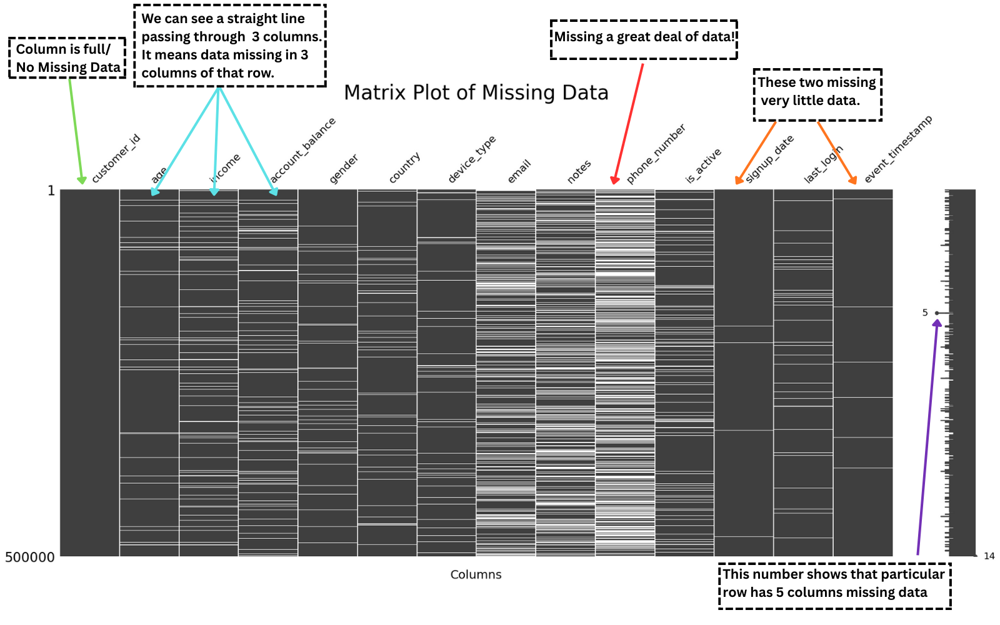

# STEP 4.b : Visualizing Missing Data 
### **(Missingness Visualization Continued)....**

In the previous steps: 

**Step 1:**  We learned what values actually count as missing (built-in + placeholders).

**Step 2:**  We explored how much data is missing at the column level.

**Step 3:**  We explored missing data at the row level.

**Step 4.a:** 

- We started exploring how we can visualize missing data with 'Easy to Understand' Bar plots.

- We also learnt about good stuff that can help us make understandable visualizations.

Now that we know about simple bar plots, we will now explore other visualization types.

## Matrix Plot:

A Matrix plot looks like "**Some chocolate bars having zebra stripes. A few of them may have too many stripes!**"

This plot shows patterns of missing data across all the rows of DataFrame.

These plots are especially useful when we want to see row-level patterns of missing data across multiple columns at once.

We can create a matrix plot of missing data by passing **'matrix'** as **viz_type** in the ``plot_missing()`` method of **MissingnessVisualizer** class.

**Example:**

    MissingnessVisualizer(df).plot_missing(viz_type = 'matrix')

**Output:**

> Here is an annotated image of **Matrix plot** used for better understanding of the plot:

We can see:

- **Bars of chocolate** having black and white zebra stripes.
- **Black** means ``data is present``, **White** means ``data is missing``.
- Column *'customer_id'* has no white stripes, which we can verify from our previous example of **Bar Plot**.
- Columns *'email'*, *'notes'* and *'phone_number'* have a good amount of missing data.
- Columns *'signup_date'* and *'event_timestamp'* have very little missing data.
- **White** lines passing through several columns in a row means **data is missing in those columns**.

> However, this image only shows a Matrix Plot of pandas **built-in missing** values.

Let us now explore what happens when we pass a list of placeholders that we consider as missing data:

## Matrix Plot - With Placeholders:

We can create a matrix plot of missing data including placeholders by passing **extra_placeholders** in the ``plot_missing()`` method of **MissingnessVisualizer** class.

**Example:**

    MissingnessVisualizer(df).plot_missing(
                viz_type = 'matrix',
                extra_placeholders = [-999, -1, '-999', '?'],    <- Passed the list of placeholders

                # Optional stuff

                title = 'Matrix Plot of Missing Data - With Placeholders', <- Title of the Plot
                title_fontsize = 30,                                       <- Title fontsize
                xlabel = 'Columns',                                        <- Label for X-axis
                xlabel_fontsize = 18,                                      <- Font size of X-axis label
                xlabel_padding = 20                                        <- Spacing around the label
    )

**Output:**

> Below is the annotated image of **Matrix plot with placeholders** used for better understanding of the plot:

We can see:

- These **Bars of chocolate** actually looked like they have zebra stripes, when we informed it what we consider as missing data.
- Column *'customer_id'* still has no white stripes, which means it has no missing data - **pandas built-in or placeholder values**.
- Column 'phone_number'* has a lot of missing data and is mostly gone. 
- Columns *'signup_date'* and *'event_timestamp'* still have very little missing data.
- **White** lines are very much visible now, compared to previous **Matrix Plot** with pandas built-in missing values.
- Which columns are missing together in the same rows of our data.

**Great!**

We now know:

1. How we can create a **Matrix** plot and how it helps us see patterns of missing data.

2. What missing data vs non-missing data looks like in a matrix plot (**did someone eat parts of my chocolate? if yes, from which places?**).

3. Being dependent only on built-in missing values would have resulted in missing a lot of important information we can get by including placeholders (if they exist).

4. Whether columns are missing data in same or different rows. 

Okay!

We know if one or more columns are missing values in the same rows or different rows.

But what if we want to know if there are any columns in my dataset that go missing together?

Like, "**If one column is missing data, will another column be missing data too?**"

We will look into how to visualize and identify this next.

## Heatmap:

A Heatmap looks like "**A colorful grid (like chessboard) showing where data is missing**".

This plot shows patterns of missing data within the columns of a dataset.

These plots are especially useful when we want to see which columns have missing values and whether **missing data tends to happen together in certain columns.**

Example:

    Income is missing in our data, is age missing too?

We can create a heatmap of missing data by passing **'heatmap'** as **viz_type** in the ``plot_missing()`` method of **MissingnessVisualizer** class.

Example:
    
    
    MissingnessVisualizer(df).plot_missing(viz_type='heatmap')  

Output: 

> Below is the annotated image of **Heatmap** used for better understanding of the plot:

We can see:

- That we have a white/gray colored staircase like grid of squares.
    
- Two squares are colored - **light blue** and **dark blue** respectively.

- On the left and bottom, we have Column Names (to identify relationships between any two columns).

- Most of the squares are colored gray, which means **'These columns do not have a relationship with each other in terms of missing data'.**

- Columns *'account_closed_at'* and *'last_seen_at'* have a Correlation of 0.2, which means **'There is a weak relationship between these two columns in terms of missingness'**

- Columns *'phone'* and *'email'* have a Correlation of 0.9, which means **'There is a strong relationship between these two columns in terms of missingness'**

## But, What is this Correlation that you just mentioned?

Well, we will read more about Correlation in Computation docs that will be added later.

For now, just know that Correlation means "**Hey, is there any relationship between these two things?**"

In this documentation, we are checking if there are any relationships across columns in terms of missing data.

## What kind of relationships are we checking?

We are checking:

- ``If there is missing data in one column and because of that, another column is missing data too.``

**Example:**

    Let's say that I'm filling a survey and I'm under 18. I don't have any source of income.

    So, I will be leaving the income column blank, and due to that my credit score column will be having missing data too.

- ``If a column is missing data independently, and has no relationship with missing data in another column.`` 

**Example:**

    In this survey, I might choose not to answer question about my favorite color. 

    This missing value has nothing to do with whether I answered the income or age columns, it is completely random due to my choice.

- ``If two or more columns have missing data at the same time.``

**Example:**

    Let's say in a medical survey, I skip the question about alcohol consumption, and might also skip questions about smoking habits. 

    These columns now tend to have missing data together, showing a pattern.

- ``If columns are missing data completely at random.``

**Example:**

    Sometimes I might accidentally skip the question about my favorite color. 

    This missing data has no connection to any other column, it’s completely independent.

- ``If there are any groups of rows that have missing data in the same columns.``

**Example:**

    A hospital collects information of patients that include their 'insurance number'.

    However, for one week, the insurance system was down.

    As a result of that, every patient registered during that week has a missing insurance number.

    This creates the same missing column across many rows.

**Great!**

We now know the kind of relationships we are looking for, through these visualizations.

What's next?

We will now explore if there are any changes to the **Heatmap** if we pass a list of placeholders.

## Heatmap - With Placeholders:

We can create a heatmap of missing data including placeholders by passing **extra_placeholders** in the ``plot_missing()`` method of **MissingnessVisualizer** class.

Example:

    MissingnessVisualizer(df).plot_missing('heatmap', extra_placeholders = [-999, 'UNKNOWN_DATE', 'CLOSED_UNKNOWN','ERROR', -1])

Output:

> Below is the annotated image of **Heatmap - With Placeholders** used for better understanding of the plot.

We can see:

- That most of the columns are showing white/gray squares, which means "**They are missing data independently in different rows**".

- Columns *'phone'* and *'email'* still have a very dark blue square and have a Correlation of 0.9, which means *"**They have a very strong positive relationship and are missing data in same rows**".

- Columns *'account_created_at'* and *'account_closed_at'* have a very faint blue colored square and have a Correlation of 0.1, which means "**Weak positive relationship however, they are missing data independently in different rows**".

- Columns *'last_seen_at'* and *'account_closed_at'* have a faint blue colored square and have a Correlation of 0.2, which means "**Weak positive relationship however, they are also missing data independently in different rows**".

- Columns *'last_seen_at'* and *'account_created_at'* have a mild blue colored square and have a Correlation of 0.5, which means "**They have an average positive relationship and are missing data both in same and different rows**".

Perfect!

We now know:

- What colors and numbers represent in a heatmap and what they mean in terms of missing data.

- What kind of relationships we can explore and how they represent patterns of missing data.

- How we can create and understand **Heatmaps** for missing data, using datalab.

But, in **Heatmaps** we explored relationships between only 2 columns at once. 

What if multiple columns, like 3 or 4 are missing data together? What do we do then?

It will be very hard to explore and know if our columns are related together using **Heatmaps**, won't it?

**Absolutely.**

Which is exactly what we will explore and identify next. 