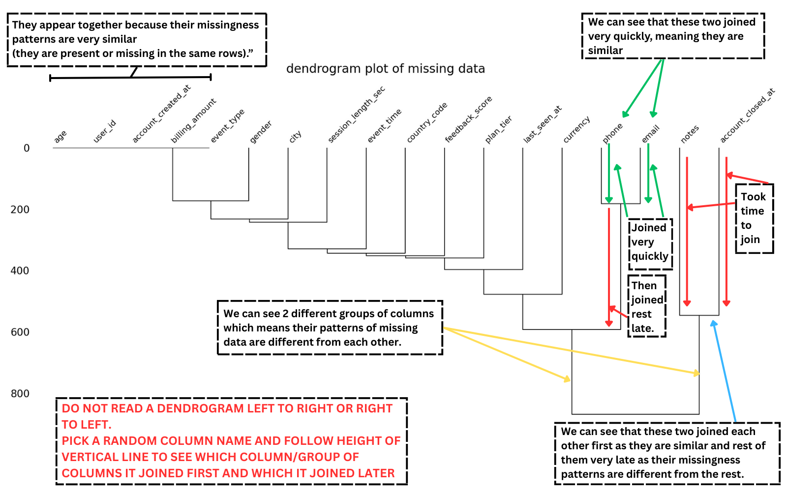

# STEP 4.c : Visualizing Missing Data 
### **(Missingness Visualization Continued)....**

In the previous steps: 

**Step 1:**  We learned what values actually count as missing (built-in + placeholders).

**Step 2:**  We explored how much data is missing at the column level.

**Step 3:**  We explored missing data at the row level.

**Step 4.a:** 

- We explored how we can visualize missing data with 'Easy to Understand' Bar plots.

- We also learnt about optional good stuff that can help us make understandable visualizations.

**Step 4.b:**

- We explored how we can visualize missing data with 'Easy to Understand' Matrix plots and Heatmaps.

- We also learnt about the questions we are trying to answer through these visualizations.

Now that we know about simple bar plots, matrix plots and heatmaps, we will now explore the remaining visualization type.

## Dendrogram:

A dendrogram looks like "**A tree without leaves, made of lines that connect related things.**"

They are very useful in checking groups of columns where data is missing similarly and groups of columns that are missing data differently.

We can create a dendrogram of missing data by using **'dendrogram'** as **viz_type** in ``plot_missing()`` method of **MissingnessVisualizer** class.

Example:

    MissingnessVisualizer(df).plot_missing(viz_type = 'dendrogram')

Output:

> Below is the annotated image of **Dendrogram** used for better understanding of the plot.

We can see:

- We have two groups of columns based on similar/different patterns of missing data.

- Columns *'notes'* and *'account_closed_at'* are grouped together separately from the group of rest of the columns.

- Columns *'phone'* and *'email'* connect at a low height almost immediately, which means **They are missing together in the same rows**.

- Columns *'user_id'*, *'age'*, and *'account_created_at'* connect very early and form a small group, which means **Missing data in these columns is almost always present together**.

- Columns related to activity -> [*'session_length_sec'*, *'event_time'*, *'last_seen_at'*, *'country_code'*, *'feedback_score'*, and *'plan_tier'*], are connected together in the middle of the tree, which means **They often appear together and are often missing together**.

- Columns *'notes'* and *'account_closed_at'* remain separate for the longest time and only connect at the very bottom of the tree, which means **They are usually missing and only appear in special cases.**

One very important thing to remember in Dendrograms: ``Columns that connect earlier in the dendrogram behave similarly, and columns that connect later behave differently.``

Great!

We now know that "Columns that have lines with low height connect early and are similar" & "Columns with more height connect later and are different."

> However, this image only shows a Dendrogram of pandas **built-in missing** values.

Let us now explore what happens when we pass a list of placeholders that we consider as missing data:

## Dendrogram - With Placeholders:

-- TO BE UPDATED -- 
